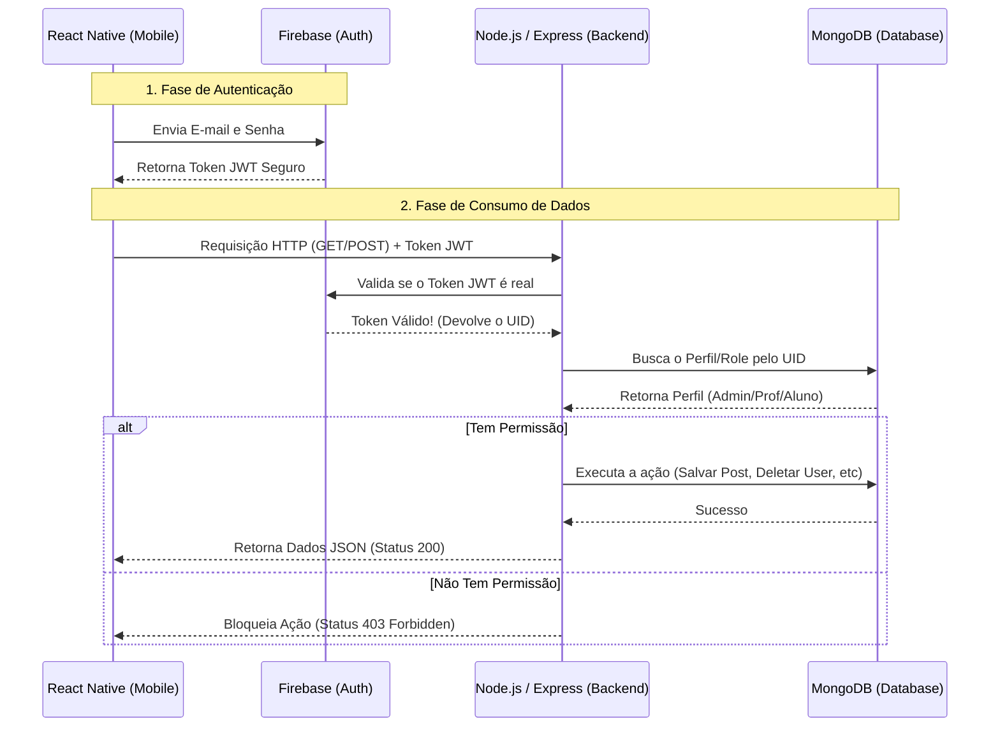

# 📱 Blogging-Escola Mobile (FIVAM)

**FIVAM - Conectar, Compartilhar, Ensinar, Aprender.**

Este aplicativo mobile foi desenvolvido em conformidade com os requisitos do Tech Challenge da Fase 4 da Pós-Graduação em Full Stack Development (FIAP). O projeto consiste em uma plataforma de blog escolar onde alunos e professores podem interagir através de postagens e comentários.

---

## 🛠 Tecnologias Utilizadas

- **Front-end Mobile:** React Native, TypeScript, Expo, Expo Router.
- **Gerenciamento de Estado:** Redux Toolkit.
- **Integração e API:** Axios (com interceptores para tokens JWT).
- **Autenticação e Segurança:** Firebase Authentication.
- **Back-end:** API RESTful em Node.js com banco de dados MongoDB (NoSQL), hospedada no Render.

---

## 🏗 Arquitetura do Projeto

A organização de pastas segue um padrão modular para separar responsabilidades, utilizando o roteamento baseado em arquivos do Expo Router:

```text
blogging-escola-mobile/
├── app/                        # 🛣️ Rotas (Expo Router)
│   ├── (auth)/                 # 🔓 Fluxo Público (Deslogado)
│   │   ├── login.tsx           # Tela de entrada e autenticação
│   │   └── register.tsx        # Tela de cadastro de novos alunos
│   ├── (app)/                  # 🔒 Fluxo Privado (Logado)
│   │   ├── (tabs)/             # Navegação Inferior (Tab Bar)
│   │   │   ├── _layout.tsx     # Configuração das Tabs
│   │   │   ├── index.tsx       # Feed de Notícias (Home)
│   │   │   ├── manage.tsx      # Painel de Gestão (Posts/Usuários)
│   │   │   └── profile.tsx     # Perfil do Usuário
│   │   ├── post/
│   │   │   └── [id].tsx        # Tela de leitura completa do Post e Comentários
│   │   └── users/
│   │       ├── index.tsx       # Tabela de listagem de usuários
│   │       └── create.tsx      # Formulário de criação/edição de usuários
│   └── _layout.tsx             # Root Layout (Provedores Globais e Gatekeeper)
├── src/                        # 🧠 Lógica e Suporte
│   ├── components/             # UI Reutilizável (Cards, Itens de Lista)
│   ├── config/                 # Configurações do Firebase
│   ├── hooks/                  # Hooks customizados
│   ├── services/               # Conexão Axios (API)
│   ├── store/                  # Redux (Estado Global)
│   └── utils/                  # Helpers (Ex: Tradução de erros Firebase)
├── assets/                     # 🎨 Mídias (Logo, Splash Screen)
└── package.json                # Dependências

```

---

## 🗺️ Arquitetura Visual e Fluxos

### 1. Fluxo de Dados e Autenticação

O diagrama abaixo detalha como o aplicativo lida com a segurança de dados, utilizando o Firebase para autenticação e o Node.js para autorização e acesso ao MongoDB.



### 2. Árvore de Navegação (UX Flow)

Estrutura de telas e permissões de acesso baseada no perfil do usuário:

```text
=======================================================================
                        INÍCIO DO APLICATIVO
=======================================================================
                                 |
                 [ app/_layout.tsx (Root Layout) ]
        (Carrega Redux, checa sessão salva no Firebase Auth)
                                 |
=======================================================================
             GATEKEEPER DE SEGURANÇA: app/(app)/_layout.tsx
=======================================================================
                                 |
           O usuário está logado e com os dados no Redux?
                                 |
               [ NÃO ] <---------------------> [ SIM ]
                  |                               |
      =========================       =========================
       FLUXO DESLOGADO (Stack)         FLUXO LOGADO (Tabs)
      =========================       =========================
                  |                               |
        app/(auth)/login.tsx           app/(app)/(tabs)/_layout.tsx
        [ TELA DE LOGIN ]                         |
                  |               ---------------------------------
            Não tem conta?        |               |               |
                  |             TAB 1           TAB 2           TAB 3
      app/(auth)/register.tsx   Home            Perfil          Admin
      [ TELA DE CADASTRO ]        |               |               |
                               (index)        (profile)       (manage)
                                  |               |               |
                           Clicar em Post     [ Logout ]    É 'professor'
                                  |                          ou 'admin'?
                          post/[id].tsx                         |
                          - Ler artigo              =========================
                          - Comentários               FLUXO ADMINISTRATIVO
                                                    =========================
                                                                |
                                             ---------------------------------------
                                             |                  |                  |
                                         Postagens         Professores           Alunos
                                    (Acesso: Prof/Admin) (Acesso: Admin)    (Acesso: Admin)
                                             |                  |                  |
                                       [Criar/Editar]     [Criar/Editar]     [Criar/Editar]

```

---

## 🎯 Experiências e Desafios

Durante o desenvolvimento, a equipe enfrentou desafios arquiteturais que exigiram tomadas de decisões estratégicas em relação aos requisitos iniciais:

- **Integração de Sistemas (Backend Legado vs. Firebase):** Inicialmente, queríamos reaproveitar totalmente o backend do projeto anterior (Node.js + MongoDB), que já possuía uma esteira de CI/CD completa (GitHub Actions, Docker Hub e Render) e facilitava a gestão da coleção de comentários via NoSQL. Simultaneamente, fomos estimulados nas práticas acadêmicas a utilizar o ecossistema do Firebase.
  A solução adotada foi criar uma **arquitetura híbrida**. O Firebase assumiu exclusivamente o papel de autenticador, gerando tokens seguros, enquanto o nosso backend Node.js passou a validar esses tokens, atuando como o autorizador final e gerenciador de dados no MongoDB.
- **Adaptação das Regras de Negócio e Jornadas de Usuário:**
  Mantivemos a essência do documento original do Tech Challenge, mas aplicamos regras rígidas de acesso através de três papéis bem definidos: `aluno`, `professor` e `admin` (um "Super Professor"). Todos os usuários devem obrigatoriamente fazer login para acessar a plataforma.
- **A Jornada do Aluno:** Ao se registrar pela tela pública de cadastro, o usuário recebe a _role_ padrão de `aluno`. Ele cai diretamente na aba _Home_, que contém o Feed de Posts paginado e com sistema de busca (Search). O aluno pode abrir qualquer postagem, realizar a leitura e participar da seção de comentários.
- **A Jornada do Professor:** Além de visualizar o feed e interagir como os alunos, o professor possui acesso à aba _Gestão_. Lá, ele pode criar novas publicações, além de editar e excluir exclusivamente as **suas próprias postagens**.
- **A Jornada do Admin (Super Professor):** O Admin atua como um professor com privilégios estendidos para garantir a ordem da plataforma. Ele pode administrar os posts de **todos** os usuários (inclusive assumindo o controle das postagens de professores que foram desligados da instituição). O Admin também tem acesso exclusivo à área de Gerenciamento de Usuários, onde realiza o CRUD (Criar, Editar, Excluir) de alunos e de outros professores. Como trava de segurança, Admins não podem excluir a si mesmos ou rebaixar seu próprio nível de acesso. Além disso ele pode mudar o papel(role) do usuário.

---

## 🤖 Uso de Inteligência Artificial

Em conformidade com a realidade de mercado e as diretrizes acadêmicas (incluindo demonstrações em aulas ao vivo), este projeto utilizou o **Gemini** como ferramenta auxiliar de arquitetura e codificação.

O uso foi pautado no aprendizado contínuo. A IA atuou como um tutor conversacional, sendo instruída via prompt a enviar códigos de forma parcelada e passo a passo ("...pretendo ir digitando e entendendo etapa por etapa..."). Isso garantiu o entendimento profundo das ferramentas (Expo, Redux e Firebase) e evitou o simples modelo de "copiar e colar".

---

## 📅 Cronograma de Desenvolvimento (Sprints)

O desenvolvimento ocorreu em 14 dias corridos, com ciclos curtos focados em entregas incrementais:

- **Sprint 1 (Dias 1 a 3):** Setup do projeto, configuração Firebase/Redux e tela de Login.
- **Sprint 2 (Dias 4 a 7):** Integração com Axios, desenvolvimento do Feed Paginado, sistema de Busca e seção completa de Comentários no Post.
- **Sprint 3 (Dias 8 a 10):** Implementação do painel administrativo de posts e proteções de rota por Role.
- **Sprint 4 (Dias 11 a 14):** CRUD de usuários (Professores/Alunos), ajustes de UI/UX, tratamento de erros e documentação final.

---

## 💻 Instalação e Uso

1. **Clonar:** `git clone https://github.com/SEU-USUARIO/blogging-escola-mobile.git`
2. **Instalar Dependências:** `npm install`
3. **Configurar:** Crie um arquivo `.env` com as chaves do Firebase e a URL da API (EXPO_PUBLIC_API_URL).
4. **Rodar:** `npx expo start -c`
5. **Testar:** Utilize o aplicativo **Expo Go** no celular ou um emulador (pressionando `a` para Android ou `i` para iOS no terminal).

---

## 👥 Desenvolvido por:

- **André Felipe da Rosa** - andre.felipe.rosa@hotmail.com
- **Felipe Colombo Pacheco** - zzfelipe396@gmail.com
- **Iago Gomes Tavares** - iago.gomes@outlook.com
- **Marcelino Patricio dos Santos** - marcelinops@gmail.com
- **Vinícius Silva de Jesus** - vini.jesus1342@gmail.com

```

```
